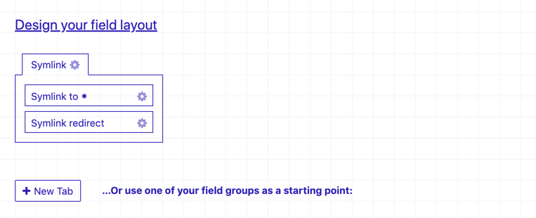

# Craft CMS Symlinked Entries

On Linux systems, a symlink is very known. It's a shortcut to another location somewhere on the system.

This idea can exist on the web as well. For example; when you have multiple menu's on your website, and 
you have repeated a page multiple times but you don't want to actual have the page multiple times.

## Requirements

This plugin requires Craft CMS 3.2 or later.

## Installation

You can install this plugin from the Plugin Store or with Composer.

#### From the Plugin Store

Go to the Plugin Store in your project’s Control Panel and search for "Symlinked". Then click on the "Install" 
button in its modal window.

#### With Composer

Open your terminal and run the following commands:

```bash
# go to the project directory
cd /path/to/my-project.test

# tell Composer to load the plugin
composer require bertoost/craft-symlinkedentries

# tell Craft to install the plugin
./craft install/plugin symlinked-entries
```

## Setup your Craft CMS

Within Craft you have to create some fields to make this possible (to make the user decide whatever happens).



### Required custom fields

These fields will be added to your Craft CMS when you install this plugin. You only have to configure 
any Entry Type to use these fields.

`symlinkTo`

This is the main field. It's a field of type "Entries" and the user should be able to set the field to a 
single Entry (as you decide by the settings).

`symlinkRedirect`

A lightswitch (flag) field to let the user decide whether the symlink-entry is reached, it should be redirected 
to it's symlinked page.

### Optional custom fields

Of course you can add any field to the Entry Type setup you want, below an example;

`symlinkCanonicalTag`

Also a lightswitch field, to let the user decide whether or not a canonical tag should be added to HTML. Of course
this only works when not redirecting.

## Templating

When a Symlinked entry is reached on the website, the plugin wil detect that it's symlinked and it will re-route
your entry to your Symlinked Entry. It also uses the template where the symlinked entry is linked to.

From here you have an extra template variable availble;

Variable     | Description
------------ | -------------------------------------------------------
entry        | The destination Entry configured as Symlink-to Entry
symlinkEntry | The original Entry, so you can use other symlink fields

#### Example usage

```twig

    <link rel="canonical" href="{{ symlinkEntry.symlinkTo.one().getUrl() }}">

```